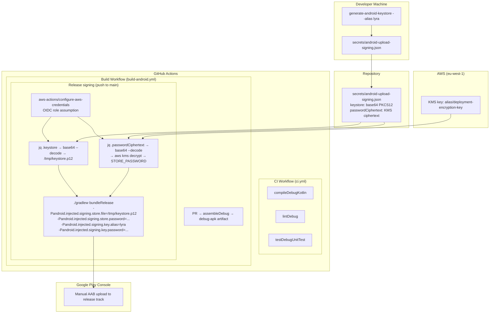

# Design Document: Google Play Deployment

## Overview

This design covers the complete pipeline for building, signing, and preparing the Kinetic-Jewelry Android app for Google Play Store deployment. The work spans seven areas:

1. **Identity change** — Migrate applicationId, namespace, and all source packages from `com.rhosys.kineticjewelry` to `ch.rhosys.lyra`
2. **Signing infrastructure** — Generate a KMS-encrypted PKCS12 keystore, commit the JSON artifact to `secrets/android-upload-signing.json`, and configure CI to decrypt at build time via OIDC role assumption
3. **CI pipeline** — GitHub Actions workflow for compile, lint, and test on every push
4. **Build pipeline** — GitHub Actions workflow producing debug APKs on PRs and signed release AABs on pushes to main, using OIDC + KMS decryption to obtain signing credentials
5. **Documentation** — SIGNING.md, CI_CD.md, and SETUP.md covering the full process
6. **Developer tooling** — Setup script, emulator management scripts, unified check command, and local build documentation
7. **Code quality hooks** — Husky git hooks with commit-msg validation and lint-staged ktlint formatting

The app uses AGP 8.5.0, Kotlin 2.0.0, JDK 17, Hilt, Room, and Jetpack Compose. Signing uses `android.injected.signing` Gradle properties (not a `signingConfigs` block), matching the pattern established in the cycle-tracker reference project.

## Architecture



## Components and Interfaces

### 1. Gradle Build Configuration (`app/build.gradle.kts`)

**Responsibilities:**
- Define `applicationId = "ch.rhosys.lyra"` and `namespace = "ch.rhosys.lyra"`
- Apply `.debug` suffix for debug builds
- Set `versionCode = 1`, `versionName = "1.0.0"`
- Enable R8 minification for release builds
- Reference proguard rules

**No signingConfigs block.** Signing is handled entirely via `-Pandroid.injected.signing.*` command-line properties passed by the CI workflow. This keeps the build file clean and avoids any conditional logic for missing credentials — Gradle simply produces an unsigned build when the properties aren't provided.

### 2. Source Package Structure

**Before:**
```
app/src/main/java/com/rhosys/kineticjewelry/
app/src/debug/java/com/rhosys/kineticjewelry/
```

**After:**
```
app/src/main/java/ch/rhosys/lyra/
app/src/debug/java/ch/rhosys/lyra/
```

All `package` declarations change from `com.rhosys.kineticjewelry.*` to `ch.rhosys.lyra.*`. All internal imports update accordingly. AndroidManifest.xml relative class references (`.KineticJewelryApp`, `.MainActivity`, `.service.KineticNotificationListenerService`) remain unchanged — they resolve relative to the namespace.

### 3. ProGuard/R8 Rules (`app/proguard-rules.pro`)

Updated to reference `ch.rhosys.lyra`:

```proguard
-keep class ch.rhosys.lyra.data.local.db.** { *; }
-keep class * extends androidx.room.RoomDatabase
-keepclassmembers class * extends androidx.room.RoomDatabase { *; }
-keep @com.google.dagger.hilt.android.HiltAndroidApp class *
-keep @dagger.hilt.android.AndroidEntryPoint class *
```

### 4. Keystore JSON (`secrets/android-upload-signing.json`)

Generated by `generate-android-keystore --alias lyra`. Structure:

```json
{
  "keystore": "<base64-encoded PKCS12 keystore>",
  "passwordCiphertext": "<base64-encoded KMS ciphertext>"
}
```

- Keystore: RSA 4096-bit, 10950-day validity, PKCS12 format
- DN: `CN=rhosys.ch, O=Rhosys AG, OU=Mobile, L=Unknown, ST=Unknown, C=CH`
- Password: 32 random bytes, base64url-encoded (no `+`, `/`, `=`)
- KMS key: `alias/deployment-encryption-key` in `eu-west-1`

This file is committed to the repo. The keystore itself is password-protected, and the password is KMS-encrypted — so the file is safe to store in version control.

### 5. Signing Configuration (CI Decryption)

The release build workflow decrypts signing credentials inline — no environment variables stored externally, no signingConfigs block in Gradle. The CI runner assumes an OIDC role with `kms:Decrypt` permission, then:

```bash
# 1. Assume OIDC role (handled by aws-actions/configure-aws-credentials)

# 2. Extract and decode the keystore
jq -r '.keystore' secrets/android-upload-signing.json | base64 --decode > /tmp/keystore.p12

# 3. Decrypt the password (plaintext exists only in memory/shell variable)
STORE_PASSWORD=$(jq -r '.passwordCiphertext' secrets/android-upload-signing.json \
  | base64 --decode \
  | aws kms decrypt --ciphertext-blob fileb:///dev/stdin --region eu-west-1 --output text --query Plaintext \
  | base64 --decode)

# 4. Build with signing properties
./gradlew bundleRelease \
  -Pandroid.injected.signing.store.file=/tmp/keystore.p12 \
  -Pandroid.injected.signing.store.password="$STORE_PASSWORD" \
  -Pandroid.injected.signing.key.alias=lyra \
  -Pandroid.injected.signing.key.password="$STORE_PASSWORD"
```

Key points:
- `KEY_ALIAS` is hardcoded as `lyra` — not a secret
- `STORE_PASSWORD` and `KEY_PASSWORD` are the same value (PKCS12 uses one password)
- Plaintext exists only in memory/temp file for the duration of the job
- The IAM role needs `kms:Decrypt` on `alias/deployment-encryption-key` in `eu-west-1`

### 6. CI Workflow (`.github/workflows/ci.yml`)

**Trigger:** Push to any branch, PR against any branch

**Jobs (parallel):**

| Job | Command | Purpose |
|-----|---------|---------|
| compile | `./gradlew compileDebugKotlin` | Catch compilation errors |
| lint | `./gradlew lintDebug` | Android lint checks |
| test | `./gradlew testDebugUnitTest` | Unit test suite |

**Environment:** ubuntu-latest, Java 17 (Temurin), Gradle cache keyed on `*.gradle.kts` + `gradle.properties` + `libs.versions.toml`.

### 7. Build Workflow (`.github/workflows/build-android.yml`)

**Trigger:** Push to main, PR targeting main

**PR path:**
1. `./gradlew assembleDebug`
2. Upload `debug-apk` artifact (7-day retention)

**Main path:**
1. `aws-actions/configure-aws-credentials` — assume OIDC role with `kms:Decrypt` permission
2. Extract keystore: `jq -r '.keystore' secrets/android-upload-signing.json | base64 --decode > /tmp/keystore.p12`
3. Decrypt password: `jq -r '.passwordCiphertext' ... | base64 --decode | aws kms decrypt ... | base64 --decode`
4. `./gradlew bundleRelease` with `-Pandroid.injected.signing.*` properties
5. Upload `release-aab` artifact (30-day retention)

### 8. Documentation

| File | Content |
|------|---------|
| `docs/SIGNING.md` | Keystore generation, KMS decryption pattern, OIDC role configuration, key rotation |
| `docs/CI_CD.md` | Workflow triggers, jobs, caching, artifact retention, OIDC setup, manual Play Store upload |

### 9. Developer Setup Script (`scripts/setup.sh`)

**Responsibilities:**
- Install all build prerequisites from a fresh clone to a working environment
- Adapted from the cycle-tracker setup script but targeting native Kotlin (no Node.js/npm dependency for the app build itself)

**Steps:**

1. **Verify Java 17** — Check `java -version` for version 17. If missing, install via `sudo apt-get install -y openjdk-17-jdk` on Linux or `brew install openjdk@17` on macOS.
2. **Download Android SDK cmdline-tools** — If `$ANDROID_HOME/cmdline-tools/latest/bin/sdkmanager` doesn't exist, download from `https://dl.google.com/android/repository/commandlinetools-linux-11076708_latest.zip`, extract to `$ANDROID_HOME/cmdline-tools/latest/`.
3. **Install SDK components** — `sdkmanager "platform-tools" "build-tools;35.0.0" "platforms;android-35"`
4. **Accept licenses** — `yes | sdkmanager --licenses`
5. **Write ANDROID_HOME to shell profiles** — Append an export block (guarded by a unique marker `# BEGIN lyra android sdk` / `# END lyra android sdk`) to `~/.bashrc`, `~/.zshrc`, and `~/.profile`. Skip if marker already present.
6. **Validate KVM on Linux** — Check `/dev/kvm` exists. If CPU supports VT-x/AMD-V (`grep -Ec '(vmx|svm)' /proc/cpuinfo`) but `/dev/kvm` is missing, install `qemu-kvm`. Warn if CPU lacks virtualisation flags.
7. **Install ktlint** — Download the standalone ktlint binary from GitHub releases to `$ANDROID_HOME/../ktlint`, make executable, and add to PATH in the marker block.
8. **Print next steps** — Restart terminal, run `scripts/emulator-create.sh`.

**Note:** A minimal `package.json` exists in the repo root for Husky (the `prepare` script runs `husky`). This is exclusively for git hooks — not for the app build. The setup script does NOT run `npm install`; developers run it manually if they want hooks active.

**Environment:**
- `ANDROID_HOME` defaults to `$HOME/Android/Sdk`
- `set -euo pipefail` for fail-fast behavior
- Exit non-zero on any critical failure

### 10. Emulator Scripts

Three scripts for managing the development AVD:

**`scripts/emulator-create.sh`:**
```bash
#!/usr/bin/env bash
set -euo pipefail
AVD_NAME="LyraAVD"
SYSTEM_IMAGE="system-images;android-35;google_apis;x86_64"
DEVICE_PROFILE="pixel_7"

SDKMANAGER="$ANDROID_HOME/cmdline-tools/latest/bin/sdkmanager"
AVDMANAGER="$ANDROID_HOME/cmdline-tools/latest/bin/avdmanager"

# Exit early if AVD already exists
if "$AVDMANAGER" list avd 2>/dev/null | grep -q "Name: $AVD_NAME"; then
  echo "Emulator '$AVD_NAME' already exists."
  exit 0
fi

yes 2>/dev/null | "$SDKMANAGER" "$SYSTEM_IMAGE" || true
echo "no" | "$AVDMANAGER" create avd \
  --name "$AVD_NAME" \
  --package "$SYSTEM_IMAGE" \
  --device "$DEVICE_PROFILE" \
  --force
```

**`scripts/emulator-start.sh`:**
```bash
#!/usr/bin/env bash
set -euo pipefail
AVD_NAME="LyraAVD"
AVDMANAGER="$ANDROID_HOME/cmdline-tools/latest/bin/avdmanager"

if ! "$AVDMANAGER" list avd 2>/dev/null | grep -q "Name: $AVD_NAME"; then
  echo "❌ AVD '$AVD_NAME' not found. Run: scripts/emulator-create.sh"
  exit 1
fi

"$ANDROID_HOME/emulator/emulator" -avd "$AVD_NAME" -no-snapshot-load
```

**`scripts/emulator-delete.sh`:**
```bash
#!/usr/bin/env bash
set -euo pipefail
"$ANDROID_HOME/cmdline-tools/latest/bin/avdmanager" delete avd --name LyraAVD
```

All scripts validate `ANDROID_HOME` is set and the SDK is installed before proceeding.

### 11. Git Hooks (Husky)

**Minimal `package.json`** (repo root — for git hooks only, not app build):
```json
{
  "private": true,
  "scripts": { "prepare": "husky" },
  "devDependencies": {
    "husky": "^9.1.7",
    "lint-staged": "^15.3.0"
  },
  "lint-staged": {
    "*.kt": ["ktlint --format"]
  }
}
```

**`.husky/commit-msg`:**
```bash
#!/bin/sh
MSG=$(cat "$1")
if [ ${#MSG} -lt 20 ]; then
  echo "❌ Commit message too short. Explain WHY this change was made (min 20 chars)."
  exit 1
fi
```

**`.husky/pre-commit`:**
```bash
#!/bin/sh
npx lint-staged
```

**Activation:** Running `npm install` triggers the `prepare` script which runs `husky`, installing the hooks into `.git/hooks/`. Developers who skip `npm install` simply don't get hooks — the app still builds fine.

### 12. Lint-Staged + ktlint

**ktlint installation:** The setup script downloads the standalone ktlint binary from GitHub releases (e.g., `https://github.com/pinterest/ktlint/releases/download/1.5.0/ktlint`) to a location on PATH (e.g., `$ANDROID_HOME/../ktlint`). This avoids adding a Gradle plugin or Node dependency for the linter.

**lint-staged configuration** (in `package.json`):
```json
{
  "lint-staged": {
    "*.kt": ["ktlint --format"]
  }
}
```

**Behavior:**
- On `git commit`, the pre-commit hook runs `npx lint-staged`
- lint-staged identifies staged `*.kt` files
- For each staged file, runs `ktlint --format` which auto-fixes formatting issues
- If ktlint finds unfixable errors, it exits non-zero and the commit is rejected
- Fixed files are automatically re-staged by lint-staged

### 13. .gitignore Additions

Append to the existing `.gitignore` (preserving all current entries):

```gitignore
# Signing keys — never commit plaintext keystores
*.jks
*.p12
*.key
*.mobileprovision
*.keystore
```

The existing `.gitignore` already contains `/local.properties`, `*.apk`, and `*.aab`.

### 14. Unified Check (`scripts/check.sh`)

```bash
#!/usr/bin/env bash
set -euo pipefail
./gradlew compileDebugKotlin lintDebug testDebugUnitTest
```

Single Gradle invocation that runs compilation, lint, and unit tests in sequence. Gradle's task dependency graph ensures they execute in the correct order. If any task fails, Gradle exits non-zero and the script propagates the failure.

This mirrors what CI runs, giving developers a local pre-push quality gate.

### 15. Local Build Commands

| Command | Output | Notes |
|---------|--------|-------|
| `./gradlew assembleDebug` | `app/build/outputs/apk/debug/app-debug.apk` | Unsigned debug APK for local testing |
| `./gradlew bundleRelease` | `app/build/outputs/bundle/release/app-release.aab` | Unsigned AAB (no signing properties) |
| `./gradlew bundleRelease -Pandroid.injected.signing.*` | Signed AAB | Requires decoded keystore + decrypted password |

**Signed local build flow:**
1. Decode keystore from JSON: `jq -r '.keystore' secrets/android-upload-signing.json | base64 --decode > /tmp/keystore.p12`
2. Decrypt password via KMS: `jq -r '.passwordCiphertext' secrets/android-upload-signing.json | base64 --decode | aws kms decrypt --ciphertext-blob fileb:///dev/stdin --region eu-west-1 --output text --query Plaintext | base64 --decode`
3. Build with signing: `./gradlew bundleRelease -Pandroid.injected.signing.store.file=/tmp/keystore.p12 -Pandroid.injected.signing.store.password="$STORE_PASSWORD" -Pandroid.injected.signing.key.alias=lyra -Pandroid.injected.signing.key.password="$STORE_PASSWORD"`

This is identical to what CI does — developers with AWS credentials can produce signed builds locally.

### 16. Setup Documentation (`docs/SETUP.md`)

**Structure:**

```markdown
# Developer Setup Guide

Everything runs through scripts. No Android Studio required.

## Prerequisites
- Java 17 and Android SDK (or just run setup.sh)

## First-time setup
- scripts/setup.sh (installs Java, SDK, ktlint, configures env)
- Restart terminal
- npm install (optional — enables git hooks)

## Emulator setup
- scripts/emulator-create.sh (one-time, downloads ~1.5GB system image)
- scripts/emulator-start.sh (launches emulator)

## Daily workflow
- Start emulator → build and install → iterate

## All commands
| Command | What it does |
|---------|--------------|
| scripts/setup.sh | Install prerequisites, configure environment |
| scripts/emulator-create.sh | Create LyraAVD emulator (run once) |
| scripts/emulator-start.sh | Start the emulator |
| scripts/emulator-delete.sh | Delete the emulator |
| scripts/check.sh | Compile + lint + test (run before pushing) |
| ./gradlew assembleDebug | Build debug APK |
| ./gradlew bundleRelease | Build unsigned release AAB |
| ./gradlew installDebug | Build and install on connected device |

## Troubleshooting
- ANDROID_HOME not found → restart terminal or source ~/.bashrc
- Emulator won't start → check KVM: ls /dev/kvm
- Java not found → sudo apt-get install openjdk-17-jdk
- Gradle build fails → ./gradlew clean then retry
```

## Data Models

### Keystore JSON Schema

```typescript
interface KeystoreJson {
  /** Base64-encoded PKCS12 keystore file (password-protected) */
  keystore: string;
  /** Base64-encoded KMS ciphertext of the keystore password */
  passwordCiphertext: string;
}
```

### Version Configuration

```kotlin
// In app/build.gradle.kts defaultConfig
versionCode = 1          // Increment by 1 per Play Store upload
versionName = "1.0.0"   // Semantic versioning: MAJOR.MINOR.PATCH
```

### OIDC Role Configuration

| Property | Value |
|----------|-------|
| Role ARN | Configured in workflow as `role-to-assume` |
| Region | `eu-west-1` |
| Permission | `kms:Decrypt` on `alias/deployment-encryption-key` |
| Auth method | GitHub OIDC federation (`aws-actions/configure-aws-credentials`) |
| Credential lifetime | Duration of the workflow job only |

## Error Handling

### Build Failures

| Scenario | Behavior |
|----------|----------|
| Missing signing properties | Gradle produces unsigned build (no error) — this is by design for local dev |
| Invalid keystore or wrong password | `bundleRelease` fails with non-zero exit, error message from jarsigner |
| R8 strips required class | Build succeeds but app crashes at runtime — mitigated by comprehensive keep rules |
| Invalid versionName format | Build proceeds (Gradle doesn't validate format) — enforced by code review |

### CI/CD Failures

| Scenario | Behavior |
|----------|----------|
| Compilation failure | `compile` job fails, PR blocked by status check |
| Lint errors | `lint` job fails, PR blocked |
| Test failure | `test` job fails, PR blocked |
| OIDC role assumption failure | `build-android.yml` fails at the `configure-aws-credentials` step with an error indicating the role could not be assumed (e.g., trust policy mismatch, missing OIDC provider) |
| KMS decryption failure | `build-android.yml` fails at the `aws kms decrypt` step with an AccessDeniedException or InvalidCiphertextException — indicates either the role lacks `kms:Decrypt` permission or the ciphertext is corrupted |
| Keystore base64 decode failure | `build-android.yml` fails at the `base64 --decode` step — indicates the `keystore` field in the JSON is malformed |

### Keystore Generation Failures

| Scenario | Behavior |
|----------|----------|
| Missing `--alias` argument | Exit code 1, usage message to stderr |
| KMS encryption failure | Exit code 1, error message, temp keystore deleted |
| keytool failure | Exit code 1, error message, temp files cleaned up |

### Setup Script Failures

| Scenario | Behavior |
|----------|----------|
| Java 17 install fails (no apt-get or brew) | Exit code 1, error with manual install instructions |
| Android SDK download fails (network error) | Exit code 1, curl fails with non-zero |
| sdkmanager component install fails | Exit code 1, error from sdkmanager propagated |
| KVM not available (no VT-x/AMD-V) | Warning printed, script continues (emulator will be slow) |
| Shell profile already contains marker block | Skip writing, print info message |

### Emulator Script Failures

| Scenario | Behavior |
|----------|----------|
| `ANDROID_HOME` not set or SDK missing | Exit code 1, error directing user to run `scripts/setup.sh` |
| AVD already exists (create) | Print message, exit 0 (idempotent) |
| AVD doesn't exist (start) | Exit code 1, error directing user to run `scripts/emulator-create.sh` |
| System image download fails | Exit code 1, sdkmanager error propagated |

### Git Hook Failures

| Scenario | Behavior |
|----------|----------|
| Commit message < 20 chars | Commit rejected, error message printed |
| ktlint finds unfixable errors | Commit rejected, lint errors displayed |
| ktlint not on PATH | lint-staged fails, commit rejected with "command not found" |
| npm/npx not available | Pre-commit hook fails, commit rejected |

## Testing Strategy

**PBT is not applicable to this feature.** The work is entirely build configuration (Gradle DSL), CI/CD pipeline setup (GitHub Actions YAML), file restructuring, and documentation. There are no pure functions with meaningful input variation to test with property-based testing.

### Verification Approach

| Area | Test Method | Command/Check |
|------|-------------|---------------|
| Package rename compiles | Smoke test | `./gradlew compileDebugKotlin` |
| Lint passes | Smoke test | `./gradlew lintDebug` |
| Unit tests pass | Regression | `./gradlew testDebugUnitTest` |
| Release build with R8 | Smoke test | `./gradlew assembleRelease` (unsigned, verifies R8 rules) |
| Signed AAB valid | Integration | `jarsigner -verify app/build/outputs/bundle/release/app-release.aab` |
| CI workflow syntax | Validation | `actionlint` or GitHub's workflow validator |
| Keystore JSON structure | Manual | Verify JSON has `keystore` and `passwordCiphertext` fields |
| KMS decrypt works | Manual | `aws kms decrypt --ciphertext-blob ...` returns plaintext |
| OIDC role assumption | Manual | Trigger workflow on main, verify `configure-aws-credentials` step succeeds |
| Setup script installs Java | Manual | Run `scripts/setup.sh` on clean machine, verify `java -version` shows 17 |
| Setup script installs SDK | Manual | Run `scripts/setup.sh`, verify `sdkmanager --list` works |
| Emulator create | Manual | Run `scripts/emulator-create.sh`, verify `avdmanager list avd` shows LyraAVD |
| Emulator start | Manual | Run `scripts/emulator-start.sh`, verify emulator boots |
| Commit-msg hook rejects short | Manual | Attempt commit with < 20 char message, verify rejection |
| Pre-commit hook runs ktlint | Manual | Stage a malformatted `.kt` file, commit, verify ktlint runs |
| Unified check | Smoke test | `scripts/check.sh` exits 0 on clean project |
| .gitignore patterns | Manual | Verify `git status` ignores `*.jks`, `*.p12`, etc. |

### What Gets Tested in CI

The CI workflow itself serves as the primary test harness:
- **compile job** validates the package rename didn't break anything
- **lint job** validates no dead imports or references to old package
- **test job** validates existing unit tests still pass after rename

### Manual Verification Checklist

Before first Play Store upload:
1. `./gradlew bundleRelease` with signing properties produces a valid AAB
2. `jarsigner -verify` confirms the AAB is properly signed
3. Google Play Console accepts the AAB upload without errors
4. App installs and runs correctly from Play Store internal testing track
