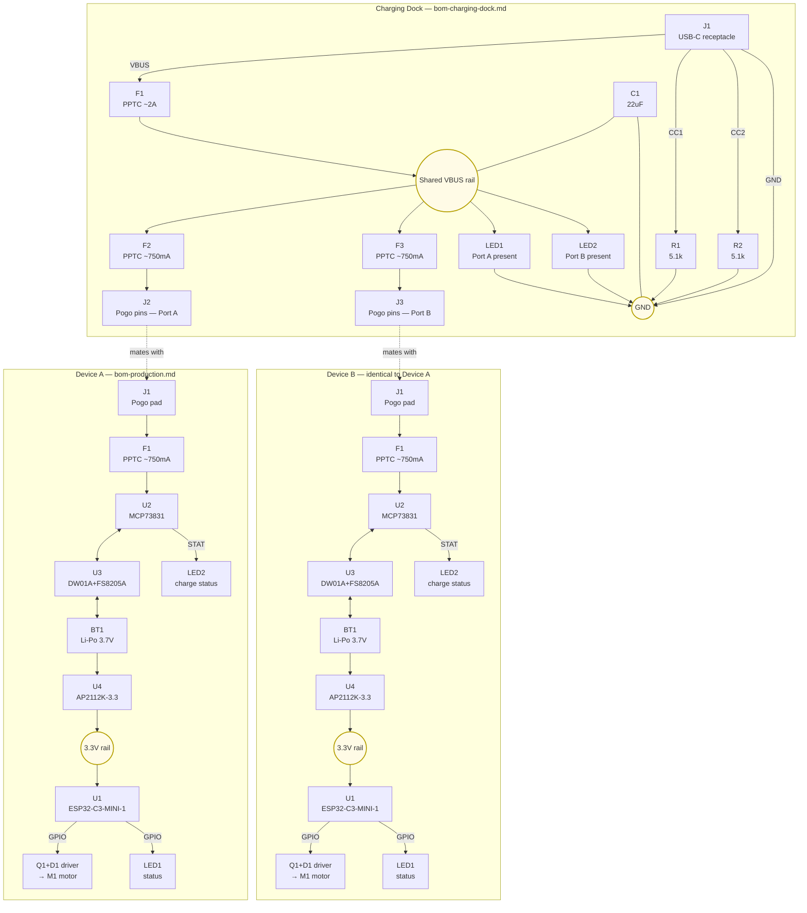

# KineticJewel – Charging System Diagram

Full power/charging path across all three BOMs: the dock
(`bom-charging-dock.md`) and two devices (`bom-production.md`), from the
USB-C plug down to the motor and status LEDs. Ref designators match the
tables in those files — each subgraph reuses its own file's refs (e.g. both
devices have their own `U1`, `J1`, etc.), so treat the subgraph boundary as
the scope for any ref, not the whole diagram.

Notes:
- Only the two pogo-pin mating connections (dotted arrows) cross the
  subgraph boundaries — the dock and each device are otherwise fully
  independent circuits, which is why either device can dock into either
  port, and either port can be empty without affecting the other.
- Charge current/termination/protection (`U2`/`U3`) live entirely on each
  device, not the dock — see the "Full charge path" sections in
  `bom-production.md` and `bom-charging-dock.md` for the prose walkthrough.
- BLE control flow (phone ↔ motor/LED once running on battery) is a
  separate concern from charging and is already diagrammed in
  `wiring.md` (applies unchanged to the production BOM's `U1`).
