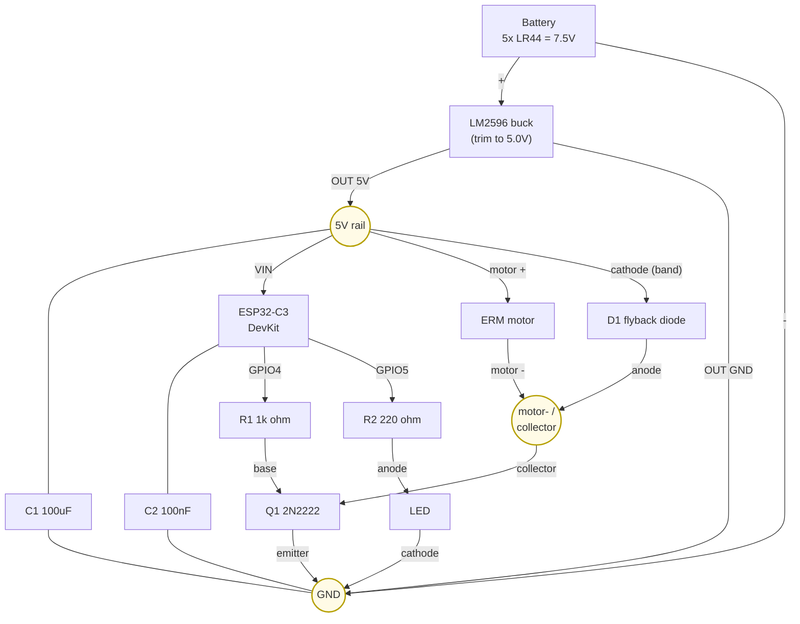
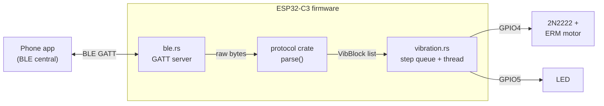
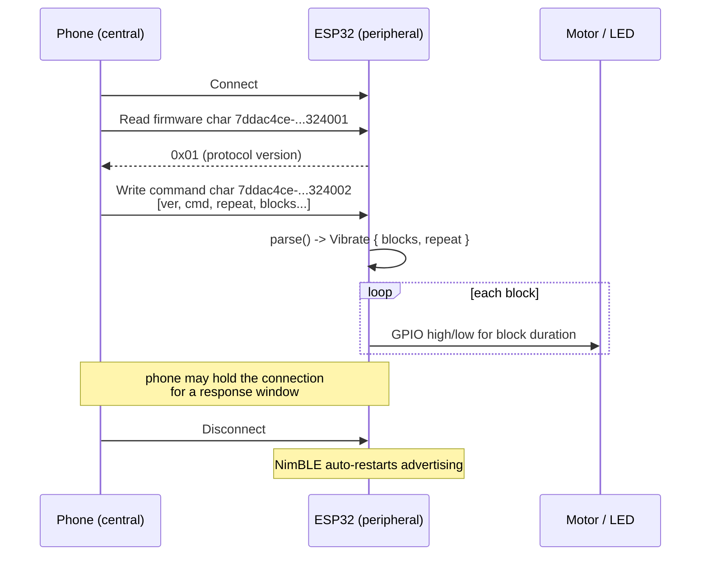

# KineticJewel – Circuit Design

## Components

| Part              | On hand | Notes                                               |
|:------------------|:-------:|:----------------------------------------------------|
| ESP32-C3 DevKit   | ✓       | Accepts 5V on VIN; has onboard 3.3V regulator       |
| 2N2222 NPN        | ✓       | TO-92: flat face toward you → E left, B middle, C right |
| LM2596 module     | ✓       | Adjust trimmer to 5.0V before connecting            |
| L7805CV           | ✓       | Alternative 5V path if you prefer (needs ≥7V in)   |
| Diodes            | ✓       | One used as flyback clamp across motor              |
| LEDs              | ✓       | One used as status indicator                        |
| Resistors         | ✓       | 1 kΩ (base), 220 Ω (LED)                           |
| Capacitors        | ✓       | 100 µF electrolytic, 100 nF ceramic                 |
| LR44 cells        | ✓       | Use 5× in series = 7.5V                            |
| ERM motor         | ✓       |                                                     |

---

## Schematic (Mermaid)

### Circuit connection diagram

Power rails are circles; components are boxes. Edge labels name the terminal /
net. The motor and flyback diode share the collector node (the diode sits in
parallel across the motor).



### Signal flow (phone → outputs)



### BLE interaction sequence



---

## Power supply

Set the LM2596 trimmer to **5.0V** before wiring anything else — measure with a
multimeter between OUT+ and OUT– while the input is connected.

```
  5× LR44 (+)──────────────► LM2596 IN+
                                  │
                             [LM2596 module]   ← trimmer set to 5.0V
                                  │
                             LM2596 OUT+ ──────────────► DevKit VIN  (5V)
                                         └─────────────► motor (+) rail (5V)
  5× LR44 (–)──────────────► LM2596 IN– / OUT– ────────► DevKit GND
```

---

## Motor driver

The 2N2222 switches the motor's ground leg.  The flyback diode catches the
inductive spike when the motor is switched off — without it the spike will
eventually punch through the 2N2222.

```
  5V rail ──────────────────────────── motor (+)
                                           │
                    ┌──[diode cathode]─────┘   ← flyback diode across motor
                    │  [diode anode]──┐
                                      │
                                  motor (–)
                                      │
                               [2N2222 Collector]
                                      │
  GPIO 4 ──[R1 1kΩ]──[2N2222 Base]   │
                        [2N2222 Emitter]
                                      │
                                     GND
```

**Base resistor check:**
- GPIO HIGH = 3.3V, V_BE ≈ 0.7V → I_base = (3.3 − 0.7) / 1000 = 2.6 mA
- Motor ~70mA, h_FE ≥ 100 → needs 0.7mA to saturate → 2.6mA ✓ fully saturated

---

## LED indicator

```
  GPIO 5 ──[R2 220Ω]──[LED anode]──[LED cathode]──GND
```

(3.3 − 2.0) / 220 ≈ 6 mA — comfortably within the GPIO 40mA limit.

---

## Decoupling capacitors

| Cap | Value  | Where                                             |
|:----|:-------|:--------------------------------------------------|
| C1  | 100µF  | Between 5V rail and GND, physically near motor    |
| C2  | 100nF  | Between DevKit VCC and GND, as close as possible  |

C1 absorbs the current surge when the motor starts.
C2 keeps the ESP32's supply stable during BLE radio bursts.

---

## Complete wiring at a glance

```
  ┌─ Power ─────────────────────────────────────────────────────────┐
  │  5× LR44 → LM2596 (5V) → DevKit VIN                           │
  │                        → motor (+)                             │
  │  GND throughout                                                 │
  └─────────────────────────────────────────────────────────────────┘

  ┌─ Motor ─────────────────────────────────────────────────────────┐
  │  GPIO4 → R1(1kΩ) → 2N2222 base                                │
  │  2N2222 collector → motor(–)                                   │
  │  2N2222 emitter   → GND                                        │
  │  motor(+)         → 5V                                         │
  │  diode: cathode → 5V,  anode → 2N2222 collector               │
  └─────────────────────────────────────────────────────────────────┘

  ┌─ LED ───────────────────────────────────────────────────────────┐
  │  GPIO5 → R2(220Ω) → LED(+) → LED(–) → GND                    │
  └─────────────────────────────────────────────────────────────────┘

  ┌─ Decoupling ────────────────────────────────────────────────────┐
  │  C1 100µF : 5V rail to GND  (near motor)                      │
  │  C2 100nF : DevKit VCC to GND  (close to chip)                │
  └─────────────────────────────────────────────────────────────────┘
```

---

## Pin map

| Function    | GPIO | Direction | Firmware constant |
|:------------|:----:|:---------:|:------------------|
| Motor drive | 4    | Output    | `PIN_MOTOR`       |
| LED         | 5    | Output    | `PIN_LED`         |
